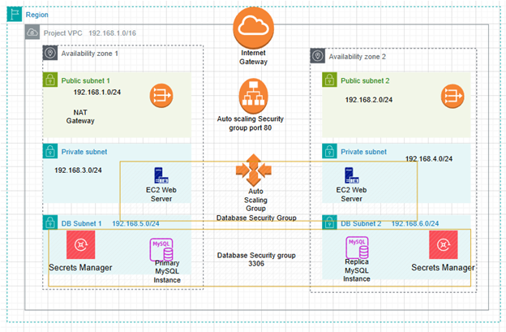

# Cloud-Based Database Migration and Security Architecture

## Overview
This project demonstrates the design and deployment of a scalable, secure, and highly available web application infrastructure for a social research organization using Amazon Web Services (AWS). The architecture incorporates AWS best practices for high availability, fault tolerance, and security.

## Key Features
- **Data Migration**: Seamlessly migrated data from an EC2-hosted MySQL database to Amazon RDS while minimizing downtime.
- **High Availability and Scalability**: Utilized Auto Scaling Groups, Application Load Balancers, and multi-AZ deployment to ensure reliability and performance.
- **Enhanced Security**: Configured security groups and integrated AWS Secrets Manager to protect sensitive credentials and restrict unauthorized access.

## Technologies Used
- **Amazon RDS**: For hosting the relational database.
- **Amazon EC2**: For initial MySQL database hosting and compute resources.
- **Application Load Balancer**: For distributing incoming traffic across multiple instances.
- **Auto Scaling Groups**: To dynamically adjust the number of instances based on demand.
- **AWS Secrets Manager**: To securely store and retrieve database credentials.
- **Security Groups**: To manage and control inbound and outbound traffic to AWS resources.

## Architecture Diagram

## Implementation Details
1. **Data Migration**: 
   - Utilized SQL dump files for migrating data from the EC2-hosted MySQL database to Amazon RDS.
   - Stored and retrieved sensitive credentials using AWS Secrets Manager to ensure a secure migration process.

2. **Infrastructure Design**: 
   - Deployed a multi-AZ setup for Amazon RDS to ensure high availability.
   - Configured Auto Scaling Groups to automatically scale EC2 instances based on application demand.

3. **Security Measures**:
   - Configured security groups to allow only necessary access to resources.
   - Implemented an Application Load Balancer to manage traffic and ensure only authorized components interact with the application.

## Results
- Achieved a robust and secure cloud infrastructure capable of handling high traffic with minimal downtime.
- Ensured seamless data migration with no significant impact on application performance.
- Secured sensitive credentials and restricted unauthorized access, maintaining data integrity.
